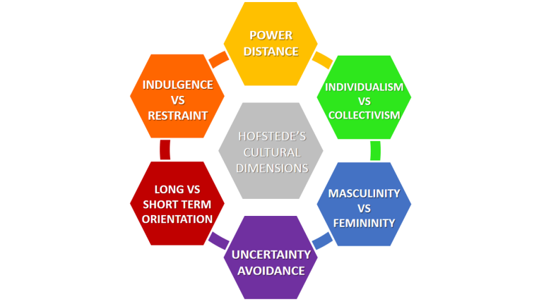

# Cultural Differences in software development
Within development environments there can be large amounts of cultural differences between stakeholders and personnel. With cultural differences, people mostly think about different countries, but what is usually more so the truth is different regions or religious backgrounds. This all can bring a big variety in not just opinions but also interpretations within the development team. Especially with the latest developments in remote working, it is more and more likely that these cultural differences come into play at some point within a software engineers career. Thus it is important that these cultural differences are explored and taught.

## Cultural Differences
Since cultural backgrounds are so diverse and have many different facets, there was a cultural dimensions framework created in 1980 by a Dutch researcher, Geert Hofstede, called *Hofstede's Cultural Dimensions Theory*. The frameworke mainly focusses on cultural differences bases on different cultures in countries. The framework examines peoples values across six different dimensions, to show the different facets of the cultural backgrounds. These six facets are:

1. Power Distance Index
2. Individualism VS Collectivism
3. Masculinity VS Feminity
4. Uncertainty Avoidance Index
5. Long Term VS Short Term Normative Orientation
6. Indulgence VS Restraint

### Power Distance Index
Everywhere in life there is a power balance. The Power Distance Index (PDI) describes this inequality and the acceptance thereof between high- and low-valued members within society. An example of this is the relationship between a child and their parents. When a society has a low PDI, back talking to a parent is more accepted because they tend to have the same equality, while in a society with a higher DPI this would not be accepted. A good example of a relatively low DPI is the Netherland, while most African countries would fall under high DPI's.

### Collectivism VS Individualism
This facet kind of speaks for itself. It describes how "hive-minded" or "self-centred" people within a society may be. When a society has many individuals who take actions for the better good of the society, it would be seen as a country with high Collectivism. Meanwhile when individuals make more choices that would be better for themselves and focus on themselves, it would be considered high Individualism. These behaviors are opposite of each other and the Individualism is often seen as selfish by the Collectivism. The Netherlands would be considered an Individualic country, while Japan is very Collectivic 

### Masculinity VS Feminity
The masculinity vs feminity facet describes the gender role difference in a culture. It is mainly focused on how much a culture values the traditional gender role divisions. Examples of Masculine values are assertiveness, courage, strength and competition, while examples of Feminine values are cooperation, nurture and quality of life. The Netherlands tends to lean towards the Masculine side of the values.

### Uncertainty Avoidance Index
How likely would members of a group be to avoid uncertainty between one another? That is what the Uncertainty Avoidance Index (UAI) describes. When a culture has a high UAI they tend to have a lot of rules which leave less room for interpretation and thus making uncertainty less likely. The opposite of this would be a culture with a low UAI, which are more lax and tend to have less strict rules. While the Netherlands is a country that hovers in the middle, but leans towards a low UAI, our neighboring country of Germany would be an example of a relatively high UAI, so are a lof of Asian cultures.

### Long Term VS Short Term Normative Orientation 
As a society it is important to set goals, but should these goals be long or short term? That is what this facet is all about. Does a culture focus more on long or short term goals and rewards. Cultures that chose for a Long Term normative orientation tend to value persistance and patience, while the Short Term normative orientations tend to focus on the near future and value fast and rapid success and gratification. Once again, the Netherlands floats in the middle of these. 

### Indulgence VS Restraint
Indulgence and Restraint are an important factor in society. It describes the level of societal impulse but also how high the level of desire for control is. When cultures have a high level of Restraint, they tend to have more impulse control and will not always want to be in the foreground. Whereas Indulgent societies have difficulty showing that impulse control and have a bigger chance to be led astray to different tasks. The Netherlands tends to be in the middle of Indulgence and Restraint. 

## Personal Experiences
### Software Semester 3
This semester was the first semester within Demand Based where there was a mix of Dutch and foreign students. Which means there was also a mix within the group projects. For my own group there are mostly Dutch students and one foreign student. Working together has taught me that the cultures are very different.

There are clear differences but also similarities that can be found using the Hofstede framework. One example of this is in how much people speak up. The Dutch people tend to speak up easier and faster.

### Friend groups
Within my friend group, we have a lot of different cultures, from Dutch, British, American, Germany and Norway. This is, of course, different than working together in a group but even in a social setting the differences are noticeable. The American find it easier to speak up and have more noticeable Masculine VS Feminine differences. While the Norwegians are more of a Long Term Orientation society. 
