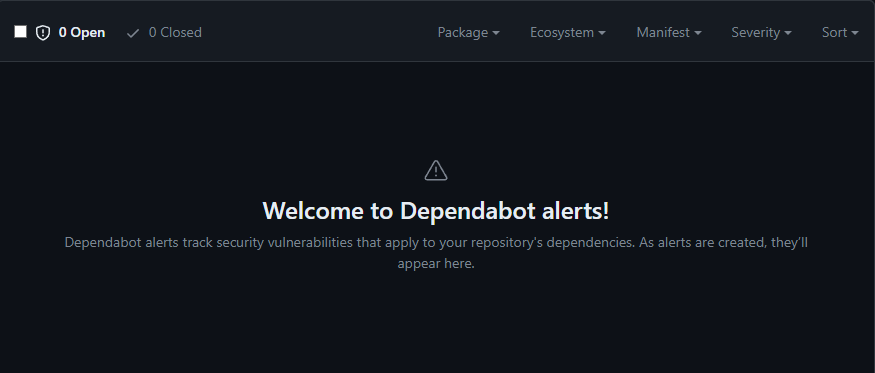
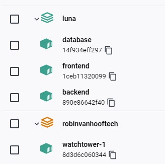

# **Products and Learning Outcomes**
This document will showcase the different products I have made during this semester. This will also explain what part of the products cover the different outcomes.

## Table of Content

## **GitHub**
Before starting anything, it was important to set up a way to handle project files in an efficient way: GitHub. I started by making an [GitHub Organization](https://github.com/FHICT-ADHDPlanner) in which I could bundle my repositories. The goal of this was to put the API, frontend and general documentation in separate repositories. This way it is easier to keep the different elements apart while keeping it in one place. 

### **CI/CD**
The next important element to set up was the CI/CD. This stands for continuous integration and continuous delivery, this means the automation of integration and delivery/deployment of the many different aspects of the project. Every repository goes through roughly the same process. Although this process does contain a few different key steps:

- Build- and unit-testing

The beginning of the CI/CD process is pretty straight forward: This step tests if the application can be build successfully. If this build is successful, then run through all the tests in the project. If these also pass then this step is done. This step is done so it can be ensured that only the functional code will be pushed to the main branches. This means that the live environment will always have the functional code. 

- Docker build-testing and deployment

The next step in this process is the docker-testing and deployment. All of the services run in dockerized containers. More about this will be discussed in the Docker chapter. To build containers, docker requires docker images. These images will be supplied through Dockerhub in separate repositories. 

When a push or merge to main transpires, the image on Dockerhub will need to be replaced with the new most recent code. This part of the CI/CD is responsible for that. The start of this is that GitHub will test if the docker image can be build from the new files in the main branch, using the custom made Dockerfile. If this build succeeds, the process will log into Dockerhub with the credentials that are in GitHub secrets, and then push this docker image to the corresponding Dockerhub repositories. If these both succeed, the new image will be deployed to Dockerhub and is ready to be used for server-sided deployment. 

<details>
<summary>GitHub CI/CD Flow File (yaml)</summary>

``` yaml
name: Main

on:
  push:
    branches: [ main ]
  pull_request:
    branches: [ main ]

jobs:
  build:
    runs-on: ubuntu-latest
    steps:
    - uses: actions/checkout@v3
    - name: Setup .NET
      uses: actions/setup-dotnet@v2
      with:
        dotnet-version: 7.0.x
    - name: Restore dependencies
      run: dotnet restore "./ADHDPlanner-Backend" 
    - name: Build
      run: dotnet build --no-restore "./ADHDPlanner-Backend"
    - name: Test
      run: dotnet test --no-build --verbosity normal "./ADHDPlanner-Backend"

  deployment:
   name: deployment
   runs-on: ubuntu-latest
   needs: build
   steps:
     - name: Checkout repository
       uses: actions/checkout@v2
     - name: Set up Docker Buildx
       uses: docker/setup-buildx-action@v1
     - name: Login to DockerHub
       uses: docker/login-action@v1
       with:
         username: ${{ secrets.DOCKER_HUB_USERNAME }}
         password: ${{ secrets.DOCKER_HUB_TOKEN }}
     - name: Build and push
       uses: docker/build-push-action@v2
       with:
         context: ./ADHDPlanner-Backend/
         file: ./ADHDPlanner-Backend/ADHDPlanner-Backend/Dockerfile
         push: ${{ github.event_name != 'pull_request' }}
         tags: ${{ secrets.DOCKER_HUB_USERNAME }}/adhdplanner-backend:latest
         
  SonarCloud:
    name: Build and analyze
    runs-on: windows-latest
    steps:
      - name: Set up JDK 11
        uses: actions/setup-java@v3
        with:
          java-version: 11
          distribution: 'zulu' # Alternative distribution options are available.
      - uses: actions/checkout@v3
        with:
          fetch-depth: 0  # Shallow clones should be disabled for a better relevancy of analysis
      - name: Cache SonarCloud packages
        uses: actions/cache@v3
        with:
          path: ~\sonar\cache
          key: ${{ runner.os }}-sonar
          restore-keys: ${{ runner.os }}-sonar
      - name: Cache SonarCloud scanner
        id: cache-sonar-scanner
        uses: actions/cache@v3
        with:
          path: .\.sonar\scanner
          key: ${{ runner.os }}-sonar-scanner
          restore-keys: ${{ runner.os }}-sonar-scanner
      - name: Install SonarCloud scanner
        if: steps.cache-sonar-scanner.outputs.cache-hit != 'true'
        shell: powershell
        run: |
          New-Item -Path .\.sonar\scanner -ItemType Directory
          dotnet tool update dotnet-sonarscanner --tool-path .\.sonar\scanner
      - name: Build and analyze
        env:
          GITHUB_TOKEN: ${{ secrets.GITHUB_TOKEN }}  # Needed to get PR information, if any
          SONAR_TOKEN: ${{ secrets.SONAR_TOKEN }}
        shell: powershell
        run: |
          .\.sonar\scanner\dotnet-sonarscanner begin /k:"FHICT-ADHDPlanner_Back-end" /o:"fhict-adhdplanner" /d:sonar.login="${{ secrets.SONAR_TOKEN }}" /d:sonar.host.url="https://sonarcloud.io"
          dotnet build "./ADHDPlanner-Backend"
          .\.sonar\scanner\dotnet-sonarscanner end /d:sonar.login="${{ secrets.SONAR_TOKEN }}"
```


</details>


### **Security and quality**
Next to the building and deployment of the application, GitHub also provides useful tools to analyze the code and make sure vulnerabilities get noticed and resolved. My project utilizes two of these technologies. These are part of the CI/CD process. These technologies are the following:

- **CodeQL**

GitHub has an integrated static code analysis tool, namely CodeQL. In my case the CodeQL was set up in a way that when there is a push or merge made, GitHub will check the code quality and any vulnerabilities before it even allows the merge or push. These vulnerabilities are noted under de security tab under the GitHub repository. When high risk vulnerabilities are found, the push/merge will be blocked until these are fixed or it is pushed through. The reasoning behind using CodeQL is that it is a native resource within GitHub. This means it is used in a lot of projects and it can be assumed that it is not only accurate but also secure. Another reasoning for using it is that it is powerful for testing both back- and frontend code. It is strong at finding vulnerabilities that a developer would not be able to find during regular code refactoring. A strong point of CodeQL is that it is fully automated through using the Actions within GitHub and thus is a CL step. Meaning there is no manual work required.

- **Dependabot**

Another production environment technology that is used to keep development safe is Dependabot. This technology is also an integrated tool within GitHub that automatically scans used dependencies of the applications and reports any vulnerabilities that it finds within said dependencies. These issues are noted in the security tab in GitHub. Once again, if a high risk vulnerability is found, the push/merge will be blocked until it is fixed or it is pushed through. Other than that Dependabot can be used to automatically fix vulnerabilities by either updating packages or finding different, similar packages instead. 

- **SonarCloud**
  
SonarCloud is the last used static code analysis tool. This is a third party tool with integrated GitHub support. By putting it in the workflow file, every time a push is made, the code will be checked by SonarCloud for code smells and vulnerabilities. 

| CodeQL | Dependabot | Sonarcloud|
| --- | --- | --- |
| |  | 

These quality assurance tools all run automatically and assure the code quality of the live application. The results of all of these tools can be used to find bugs before they reach the live environments, but also to ensure that the code is safe. However, in development teams these platforms would need to be checked regularly since they do not require any active interaction. An example of this is looking at the results of these platforms in each sprint retrospective and deciding what vulnerabilities to work on in the following sprint.

### **Outcomes**
This product is part of learning outcomes 2, 3 and 4. 


## **Task-API**
The first real product I have worked on for this project was the main API backend application that makes sure that tasks can be requested, saved and edited. The API contains Access points. These access point. These access points are CRUD access points for data and are only meant to be accessed by authorized users. 

The decision was made to use CRUD instead of CRUA because of the nature of the service. It is not necessary to archive any data if the user wants to delete a task from their planner. Thus CRUD was used. 

### **Accessing the API**
As the API is running on a separate server, the endpoints are slightly different. In this case, the API endpoints will be:
> GET Task: http://86.92.40.132:1001/api/Task/{id}

> GET Tasks: http://86.92.40.132:1001/api/Task

> POST Task: http://86.92.40.132:1001/api/Task

> PUT Task: http://86.92.40.132:1001/api/Task/{id}

### **API Documentation**
The main component of API documentation is the Swagger portal. This is the one place where all the endpoints are and will be documented. The endpoints will be automatically generated at the startup of the program and can be updated when the live code changes. 

A second reason the Swagger portal is useful is because it also offers tools to make calls to live production servers or local test servers. This can be used to test endpoints and try new things with them. 

 

### **Outcomes**
This product is part of learning outcomes 1, 2 and 4.

## **ADHD-Planner Frontend**
Another important part of any web application is the frontend of the platform. This application integrates both [Auth0](#auth0) and the [Task-API](#task-api). This was done so it could function as a CRUD frontend that people could use to plan their day, week, months. Once a Task is created, it will be shown in the calendar. 

The integration of Auth0 means there is a safe and secure way to log in and make sure the user can only see the tasks that they put in. Due to the login tokens or credentials not being stored server nor client sided, it makes this login very secure and reliable. 

> The live version of the ADHD-Planner can be found [here](https://86.92.40.132:3000/)

### **Outcomes**
This product is part of learning outcome 1.

## **Docker**
All parts of the ADHD-Planner project are running on a live server environment. However, it is not run in independent single applications, but as one hole in a Docker unit, split into multiple containers. Each part has gotten its own container. As explained in the [GitHub](#github) chapter, the images are automatically made and pushed to a Docker repository when a push/merge is made on the main branch. 

### **Containers**
In total there are four different containers. These are as follows:

- **Frontend container**
  
This container hosts the ADHD-Planner frontend, this part is described in the [ADHD-Planner Frontend](#adhd-planner-frontend) chapter.

- **API/Backend container**
  
This container hosts the Task API, the API has been explained further in the [Task-API](#task-api) chapter.

- **Database container**

This container is responsible for hosting the database. The database is an MSSQL database which is responsible for storing all the tasks that the user needs. The way the database is structured is done through Migrations, this means that whenever the code changes, the database updates. 

- **Watchtower container**

All of the other containers need to stay up to date with the latest code in the main GitHub branches. For this, an extension called Watchtower was used. Watchtower is a dockerised application that runs next to the other containers and checks on regular intervals if there are any new images have been pushed to DockerHub. If watchtower sees updates in the images, it will automatically update the container and pull the latest code into the live environment so it always stays up to date. The decision was made to go for a Watchtower container as it is a quick solution for automated deployment. It means that the code in the containers will always be up to date with the latest GitHub repositories. This makes running a public production environment a lot easier.

### **Compose**
To start and manage all of these different containers, Docker Compose was used. The choice was made to use Docker Compose as it allows for customization within the startup sequences. This is in contrary to the commands that have to be entered individually to start each containers with vanilla Docker. In a compose file a few key components need to be specified:
- The Docker image to use for the container.
- Volumes for the database container as without these volumes the data gets reset on a container reset.
- The environmental variables that the container depends on.
- Binding the port that the container should run on. 

<details>
<summary>Docker Compose file (yaml)</summary>

``` yaml
version: "3.8"
services:
  # Data Services
  luna_db:
    container_name: database
    image: "mcr.microsoft.com/mssql/server:2019-latest"
    environment:
        SA_PASSWORD: "*Password*"
        ACCEPT_EULA: "Y"
    volumes:
      - ./mssql-db:/var/opt/mssql/data
    ports:
      - 1434:1433

  luna_backend:
    container_name: backend
    image: "evalynnluna/adhdplanner-backend:latest"
    environment:
      ConnectionStrings__PlannerDatabase: "Server=luna_db;Database=PlannerDatabase;User=sa;Password=*Password*;TrustServerCertificate=true;"
      Kestrel__Endpoints__Http__Url: "http://+:1001"
    ports: 
      - 1001:1001      
    depends_on:
      - luna_db
  
  luna_frontend:
    container_name: frontend
    image: "evalynnluna/adhdplanner-frontend:latest"
    environment:
      REACT_APP_API_URL: "https://luna.robinvanhoof.tech"
      HTTPS: true
    ports: 
      - 3000:3000      
  
  watchtower:
    image: containrrr/watchtower
    volumes:
      - /var/run/docker.sock:/var/run/docker.sock      
    command: --interval 300

networks:
  default:
    name: nginx-network
```
</details>

|Docker view|
| --- |
|  | 

### **Outcomes**
This product is part of learning outcomes 1, 3 and 4.

## **Testing**
Testing was already briefly talked about in the [GitHub](#github) chapter. Those tests were focussed on the code quality and any mistakes that may have happened during development. However, there are other kinds of testing that are important during the development.

### **Unit testing**
Unit testing is meant to test one specific functionality of an application. However due to the way my backend was set up, I did not have many functionalities to test with unit tests. Due to this and time constraints I decided to leave unit testing to the side and continue on with Integration testing

### **Integration testing**
Another important part of testing is integration testing. Integration testing means testing the application through an external service or application with only using the application. For this project, I decided to use Postman to run my integration testing.

These Postman integration tests were eventually added to a test project in the backend application. Due to moving them to the project they were able to be run automatically on a push or merge to the main branch as explained in the [GitHub](#github) chapter. 

### **Outcomes**
This product is part of learning outcome 2.

## **Auth0**
Another microservice that was used was Auth0. As an external microservice, it takes the responsibility of user authorization and will handle this in a secure and safe way. Many developers use this platform, even in bigger applications and companies since it takes the hassle out of making a fully own log in system and the security of it. 

The decision was made to use Auth0 over any other authorization service because it is an industry-wide accepted standard. Other than that, the documentation that Auth0 provides is superior over the competitors. It provides a step-by-step guide on how to use it in the code. 

### **Outcomes**
This product is part of learning outcomes 1 and 4.

## **Learning Outcomes**
In the chapters above, it was already shown what learning outcomes they are a part of. However, to make this more clear there is a table to summarize all outcomes and what products are a part of them

| Outcome | Products|
|--- | --- | 
|You design and build user-friendly, full-stack web applications.| [Task API](#task-api), [ADHD Planner Frontend](#adhd-planner-frontend), [Docker](#docker), [Auth0](#auth0)|
| You use software tooling and methodology that continuously monitors and improve the software quality during software development. | [GitHub](#github), [TaskAPI](#task-api), [Testing](#testing)|
| You design and implement a (semi)automated software release process that matches the needs of the project context | [GitHub](#github), [Docker](#docker) |
| You act in a professional manner during software development and learning. | [GitHub](#github), [Task API](#task-api), [Docker](#docker), [Auth0](#auth0), [Research](/Researches/)