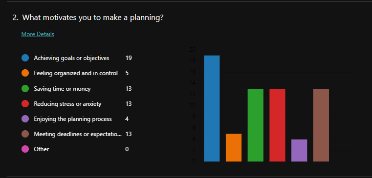
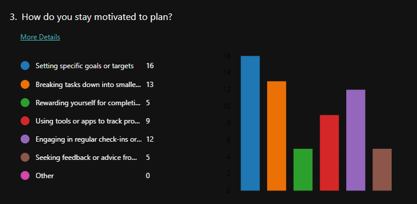
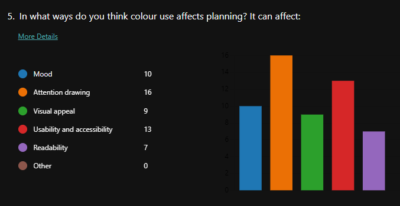
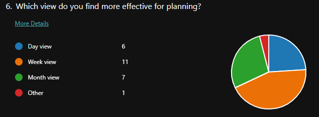
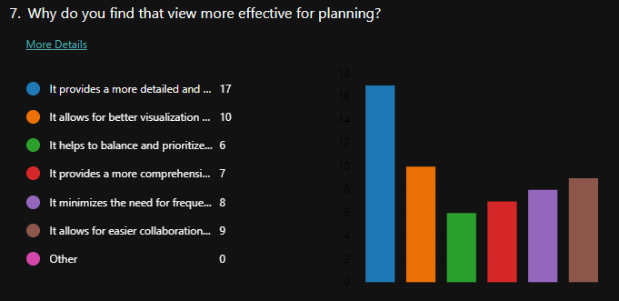
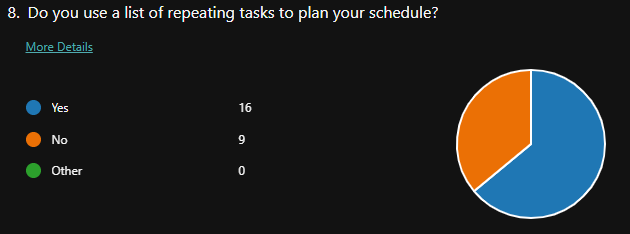
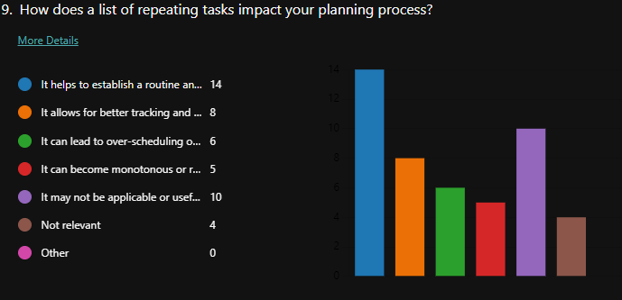

# ADHD and Project Management

## Introduction
Attention Deficit Hyperactivity Disorder (ADHD) is usually diagnosed in childhood, with 75% of the diagnosis persisting into adolescence. Around 4 to 6% of adolescents have been diagnosed with ADHD. However, this is the age range where most people are either studying in higher education or working. This means that the disorder can start manifesting itself in new ways, as there are different responsibilities and expectations (Barkley et al., 2008, p. 156; Jensen et al., 2021; Langberg et al., 2013). 

The hyperactive and impulsivity facets of the disorder regularly decline during the transition between childhood and adolescence. The attention facet often remains constant or get amplified. The attention deficit often expresses itself in academic and professional situations. The deficit can be a concern, however it is often paired with hyperfocus. When there is an hyperfocus present, it can be trying to focus on anything else but the hyperfocus subject (Groen et al., 2020; ). This functions the same when in a social environment. People with ADHD often have trouble picking up on social cues and continuing conversations if it is not about their preferred subject (Uekermann et al., 2010; Willcutt et al., 2005)).

Another facet to consider is the executive disfunction one, which can reflect in poor planning, judgement and emotional control. Executive function is referencing the capability to self-regulate. This is the facet that this research is going to be focused on, as it is responsible for the capability to plan, gain gratification, persistence of intention, control of attention and mood (Antshel et al., 2010; Barkley et al., 2008).

The challenges that adolescents with ADHD face are often within their jobs or academics, in part due to poor organization of time and trouble maintaining routines. These challenges are often met with taking medication to lessen the symptoms of the disorder. However, this is not an option for everyone due to the side effects. This warrants looking for a different options. Another option is therapy, such as Goal Management Training. This can help people with ADHD set goals and manage their projects (Langberg et al., 2008; Fabio & Caprì, 2017; Jensen et al., 2021). 

Nonetheless, there is not a tool geared specifically towards people with ADHD to customize to their liking, to set goals in and manage what their are working on. The goal of this research is to determine, between a pool of participants, what people with ADHD want within management tool and how they prefer to plan their day, week or project. 

The main research question in this instance is "**What ways of project management work for individuals with Attention Deficit Hyperactivity Disorder?**"

This main question can be divided in sub-questions:
- What motivates someone with ADHD to plan?
- How does color use affect planning?
- What is a more effective way of showing a planning, a day, week or month view and why?
- How does a list of repeating tasks influence the way people with ADHD plan?

## Materials and Method
To get answers to the sub-questions and eventually the main question, a survey will be conveyed amongst people with ADHD. This survey will consist of a pair of questions per sub-question to get a clear overview of the needs and wants of the target audience.  
For sub-question one "What motivates someone with ADHD to plan?" the questions will be as follows:
- What motivates you to make a planning?
  - Achieving goals or objectives
  - Feeling organized and in control
  - Saving time or money
  - Reducing stress or anxiety
  - Enjoying the planning process
  - Meeting deadlines or expectations
  - Other (please specify): _______
- How do you stay motivated to plan?
  - Setting specific goals or targets
  - Breaking tasks down into smaller, manageable steps
  - Rewarding yourself for completing tasks or milestones
  - Using tools or apps to track progress and stay organized
  - Engaging in regular check-ins or reviews to evaluate progress
  - Seeking feedback or advice from others
  - Other (please specify): _______

Sub-question two can be divided into two different questions for the survey:
- How important do you consider color use in planning? 
  - In a 1 to 10 format
- In what ways do you think color use affects planning? It can affect:
  - Mood
  - Attention drawing
  - Visual appeal
  - Usability and accessibility
  - Readability
  - Other (please specify): _______

Sub-question three:
- Which view do you find more effective for planning?
  - Day view
  - Week view
  - Month view
  - Other (please specify): _______
- Why do you find that view more effective for planning?
  - It provides a more detailed and focused view of tasks and activities.
  - It allows for better visualization and organization of upcoming events or deadlines.
  - It helps to balance and prioritize tasks over a longer period of time.
  - It provides a more comprehensive overview of availability and scheduling.
  - It minimizes the need for frequent updates or changes to the planning.
  - It allows for easier collaboration or communication with others.
  - Other (please specify): _______

Sub-question four:
- Do you use a list of repeating tasks to plan your schedule?
  - Yes
  - No
- How does a list of repeating tasks impact your planning process?
  - It helps to establish a routine and streamline planning.
  - It allows for better tracking and management of recurring responsibilities.
  - It can lead to over-scheduling or a lack of flexibility in planning.
  - It can become monotonous or repetitive, leading to decreased motivation.
  - It may not be applicable or useful for all types of tasks or activities.
  - Other (please specify): _______
  - Not relevant

These questions will be put in a microsoft forms format. This was chosen because it is a reliable way to get answers from the target audience. Another reason was that this can already generate graphs and data analytics for the user. 

## Results
The questionnaire has been filled in 25 times. In all 25 of these, the user specified that they are a person with ADHD. This means that all the responses are in line with the target audience for this research. 

For question 2, What motivates you to make a planning?, the main answer was "Achieving goals or objectives" with 19 picks. However also "Saving time and money", "Reducing stress or anxiety" and "Meeting deadlines or expectations" had a high pick rate with 13 picks each. 

Question 3, How do you stay motivated to plan?, was more divided in the answers. In the top 3 were the answers:

1. Setting specific goals or targets (16)
2. Breaking tasks down into smaller, manageable steps (13)
3. Engaging in regular check-ins or reviews to evaluate progress (12)

When asked how important color is considered in planning, an average rating of 7,28 was given. With 24%, the most picked number was 6. 

The most important use of color seems to be "Attention drawing" (16) and "Usability and accessibility" (13). However, it also became more clear that "Mood" (10) is a big factor in choosing what color to use. Ones mood can als be affected by the color use, which makes it important to have color schemes.

As for what the most efficient way of viewing the schedule is, the opinions were very divided. "Week"(11) did have the most votes but "Day"(6) and "Month" (7) were close. 

Details were the most chosen reason for preferring a specific way of showing a schedule. Collaboration and visualization were the next highest up. It is important to have multiple options when it comes to planning with ADHD. That way they can chose what works best for them and switch back and forth.

64% of the users specified that they use recurring tasks, with as the most given reason that it establishes a routine. For the other 36% that do not use recurring tasks, the reason that was most given was that it either becomes monotonous or leads to overscheduling. 

The results are, as expected, spread out. This has to be taken into account when drawing the conclusions.

## Conclusion
The way that this research has been conducted resulted in a very varied result and thus conclusion. Every person with ADHD is different and will respond differently to the stimuli. A way to combat this in making the application is by giving different options. Thus there will be a day, week and month view that can be switched between and different color schemes to fit with the person. As for the recurring tasks, there will be the option to make a list of recurring tasks but this will be an option. 

The research would have been more conclusive if more questions would have been put out and if there would have been a control group. However, due to the scale and manpower on this research this was not possible. 

## References
Antshel, K. M., Faraone, S. V., Maglione, K., Doyle, A. T., Fried, R. E., Seidman, L. J., & Biederman, J. (2010). Executive functioning in high-IQ adults with ADHD. Psychological Medicine, 40(11), 1909–1918. https://doi.org/10.1017/s0033291709992273 

Barkley, R. A., Murphy, K., & Fischer, M. (2008). ADHD in adults: what the science says. Choice Reviews Online, 45(09), 45–5266. https://doi.org/10.5860/choice.45-5266 

Fabio, R. A., & Caprì, T. (2017). The executive functions in a sample of Italian adults with ADHD: attention, response inhibition and planning/organization. Mediterranean Journal of Clinical Psychology, 5(3). https://doi.org/10.6092/2282-1619/2017.5.1636 

Groen, Y., Priegnitz, U., Fuermaier, A. B. M., Tucha, L., Tucha, O., Aschenbrenner, S., Weisbrod, M., & Pimenta, M. G. (2020). Testing the relation between ADHD and hyperfocus experiences. Research in Developmental Disabilities, 107, 103789. https://doi.org/10.1016/j.ridd.2020.103789 

Jensen, D. D., Halmøy, A., Stubberud, J., Haavik, J., Lundervold, A. J., & Sørensen, L. (2021). An Exploratory Investigation of Goal Management Training in Adults With ADHD: Improvements in Inhibition and Everyday Functioning. Frontiers in Psychology, 12. https://doi.org/10.3389/fpsyg.2021.659480 

Langberg, J. M., Becker, S. P., Epstein, J. N., Vaughn, A. J., & Girio-Herrera, E. (2013). Predictors of Response and Mechanisms of Change in an Organizational Skills Intervention for Students with ADHD. Journal of Child and Family Studies, 22(7), 1000–1012. https://doi.org/10.1007/s10826-012-9662-5 

Langberg, J. M., Epstein, J. N., & Graham, A. L. (2008). Organizational-skills interventions in the treatment of ADHD. Expert Review of Neurotherapeutics, 8(10), 1549–1561. https://doi.org/10.1586/14737175.8.10.1549 

Uekermann, J., Kraemer, M., Abdel-Hamid, M., Schimmelmann, B. G., Hebebrand, J., Daum, I., Wiltfang, J., & Kis, B. (2010). Social cognition in attention-deficit hyperactivity disorder (ADHD). Neuroscience & Biobehavioral Reviews, 34(5), 734–743. https://doi.org/10.1016/j.neubiorev.2009.10.009 

Willcutt, E. G., Doyle, A. E., Nigg, J. T., Faraone, S. V., & Pennington, B. F. (2005). Validity of the Executive Function Theory of Attention-Deficit/Hyperactivity Disorder: A Meta-Analytic Review. Biological Psychiatry, 57(11), 1336–1346. https://doi.org/10.1016/j.biopsych.2005.02.006
